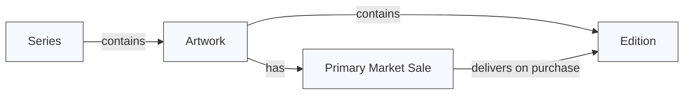

# Key concepts

### Edition

An edition is an NFT. 

### Artwork

An artwork is a container for editions and can host a primary market sale.

### Series

Series (also known as collections) contain one or more artworks.

If a series contains an artwork with an active or upcoming primary market sale, the primary market sale is displayed at the top of the page ([example](https://verse.works/series/what-can-be-by-addie-wagenknecht)).

If a series contains more than one artwork with active and/or upcoming primary market sales, then a grid of artworks is displayed at the top of the page ([example](https://verse.works/series/web97-by-khc)).

If any child artworks contain any editions, a grid of editions is displayed below any active/upcoming primary market sales.

If no child artworks have an upcoming or active primary market sale, only a grid of editions is displayed ([example](https://verse.works/series/fields-by-erik-swahn)).

We recommend embedding series instead of artworks wherever possible. 

### Primary market sale

A primary market (PM) sale is a sale from which collectors can purchase editions from the artist and/or gallery.

PM sales are configured for artworks. 

When a collector make a purchase from a PM sale, they receive an edition.

### Projects & sale types

Please refer to https://docs.verse.works/docs/intro to learn more about project types, sale types, smart contracts and more.

