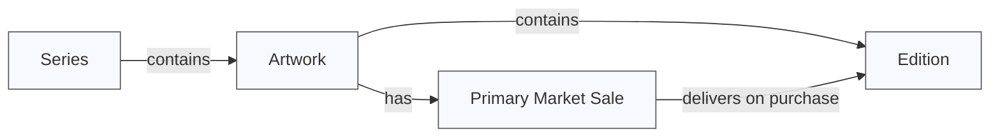

# Verse Embedded

A JavaScript library that helps you integrate Verse Primary Market features into your existing websites.

## Installation

```bash
npm install
npm run build
```

## Usage

Add the script to your `<head>`:

```html
<script src="dist/verse-embedded.js"></script>
```

Initialize the library when the DOM is ready:

```js
const verseEmbed = new VerseEmbed({
 baseUrl: "https://iframe.verse.works",
});
verseEmbed.initialize();
```

Then add the following div anywhere you want a Verse series/artwork/edition iframe to appear:

### Load a Series (Recommended)

```html
<div
 verse-series-slug="internal-lullabies-for-the-disenfranchised"
 verse-custom-styles-path="http://localhost:3000/verse-styles.css"
></div>
```

### Load an Artwork

```html
<div
 verse-artwork-id="57883342-1032-4820-b318-b42fa761e1aa"
 verse-custom-styles-path="http://localhost:3000/verse-styles.css"
></div>
```

### Load an Edition

```html
<div
 verse-artwork-id="57883342-1032-4820-b318-b42fa761e1aa"
 verse-edition-number="1"
 verse-custom-styles-path="http://localhost:3000/verse-styles.css"
></div>
```

### Attributes

| Attribute                  | Description                                         |
| -------------------------- | --------------------------------------------------- |
| `verse-artwork-id`         | Verse artwork ID                                    |
| `verse-edition-number`     | Verse edition number                                |
| `verse-series-slug`        | Verse series slug                                   |
| `verse-custom-styles-path` | Path to a CSS file to override Verse default styles |

## Custom CSS

Because Verse uses a build system, class names may include postfixes that are not known in advance. In the current version, you should target elements using partial class name matches.

For example:

```css
[class*="CollSinglePMSection_assetCoverRoot"] {
 --forced-max-width: 200px !important;
}
```

## Origin Allowlist

- You can embed Verse iframes only on `localhost:3000` by default
- To make it available on your website, contact the Verse tech team with your origin for whitelisting

## HTTPS Requirement

Production integration of Verse Frame / Verse Elements requires the parent page to be served over HTTPS. Verse iframes will not load on pages served over plain HTTP in production environments. Ensure your site has HTTP-to-HTTPS redirects configured before going live.

## Development

- `npm run build` - Build the library
- `npm run dev` - Watch for changes and rebuild
- `npm run type-check` - Run TypeScript type checking

## Local Testing

```bash
npm run serve
```

## Requirements

- Modern browser with ES2020 support
- TypeScript 5.3.3 or higher (for development)

## Key Concepts



### Edition

An edition is an NFT.

### Artwork

An artwork is a container for editions and can host a primary market sale.

### Series

Series (also known as collections) contain one or more artworks.

If a series contains an artwork with an active or upcoming primary market sale, the primary market sale is displayed at the top of the page ([example](https://verse.works/series/what-can-be-by-addie-wagenknecht)).

If a series contains more than one artwork with active and/or upcoming primary market sales, then a grid of artworks is displayed at the top of the page ([example](https://verse.works/series/web97-by-khc)).

If any child artworks contain any editions, a grid of editions is displayed below any active/upcoming primary market sales.

If no child artworks have an upcoming or active primary market sale, only a grid of editions is displayed ([example](https://verse.works/series/fields-by-erik-swahn)).

We recommend embedding series instead of artworks wherever possible.

### Primary Market Sale

A primary market (PM) sale is a sale from which collectors can purchase editions from the artist and/or gallery.

PM sales are configured for artworks. When a collector makes a purchase from a PM sale, they receive an edition.

## Further Reading

Refer to the [Verse documentation](https://docs.verse.works/docs/intro) to learn more about project types, sale types, smart contracts and more.
